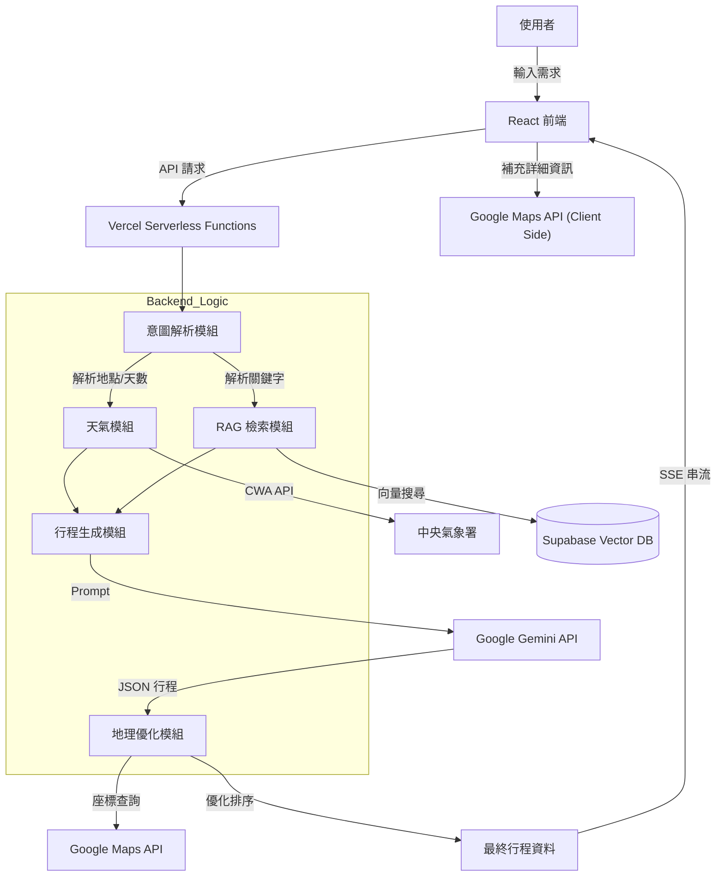

# 專題報告書：基於 RAG 技術與生成式 AI 的台灣智慧旅遊行程規劃系統

---

## 摘要 (Abstract)

隨著旅遊需求的個人化與多樣化，傳統的旅遊行程規劃方式（如搜尋引擎、旅遊書籍）已難以滿足現代使用者的需求。資訊過載、景點資訊分散以及路線規劃的複雜性，使得規劃一趟完美的旅程往往需要耗費數小時甚至數天的時間。

本專題旨在開發一套「基於 RAG (Retrieval-Augmented Generation) 技術與生成式 AI 的台灣智慧旅遊行程規劃系統」。系統整合了 Google Gemini 大型語言模型、Supabase 向量資料庫、Google Maps API 以及中央氣象署 (CWA) 開放資料。透過 RAG 技術，我們解決了大型語言模型常見的「幻覺」問題，確保推薦景點的真實性；透過自行研發的地理空間演算法 (Geo-Optimizer)，解決了行程路線順暢度的問題；並採用 Server-Sent Events (SSE) 串流技術，提供使用者即時且流暢的互動體驗。

本報告將詳細闡述系統的架構設計、核心演算法實作、遇到的技術瓶頸及其解決方案，並展示系統的實際應用成果。

---

## 目錄 (Table of Contents)

1.  **第一章：緒論**
    1.1 研究背景與動機
    1.2 研究目的
    1.3 系統範圍與限制
    1.4 預期貢獻

2.  **第二章：文獻探討與技術背景**
    2.1 生成式 AI 與大型語言模型 (LLM)
    2.2 檢索增強生成 (RAG) 技術原理
    2.3 向量資料庫與語意搜尋
    2.4 地理資訊系統與路徑規劃演算法
    2.5 現代化 Web 應用程式架構 (Vercel & React)

3.  **第三章：系統架構與設計**
    3.1 系統總體架構圖
    3.2 前端設計 (React + Vite)
    3.3 後端設計 (Vercel Serverless Functions)
    3.4 資料庫設計 (Supabase PostgreSQL + pgvector)
    3.5 外部 API 整合策略

4.  **第四章：核心功能實作細節**
    4.1 自然語言意圖解析模組
    4.2 RAG 檢索系統實作
    4.3 地理空間優化演算法 (Geo-Optimizer)
    4.4 混合式資料豐富化策略 (Hybrid Data Enrichment)
    4.5 即時天氣資訊整合

5.  **第五章：系統效能優化與挑戰解決**
    5.1 Vercel Serverless Timeout (60s) 的挑戰與對策
    5.2 解決 AI 幻覺：真實性驗證機制
    5.3 地址匹配與座標校正問題
    5.4 提升使用者體驗：SSE 串流回應

6.  **第六章：系統展示與測試**
    6.1 使用者介面流程
    6.2 案例分析：多日跨縣市行程
    6.3 案例分析：特定主題（親子/美食）行程

7.  **第七章：結論與未來展望**
    7.1 結論
    7.2 未來工作

8.  **參考文獻**

---

## 第一章：緒論

### 1.1 研究背景與動機

在後疫情時代，國內旅遊需求大增，自由行成為主流。然而，規劃自由行行程是一個複雜的決策過程，涉及多個變數：
1.  **地點選擇**：需要從成千上萬個景點中篩選出感興趣的地點。
2.  **時間安排**：需要考慮景點的營業時間、建議停留時間。
3.  **交通路線**：需要規劃最順暢的路線，避免來回奔波。
4.  **外部因素**：天氣狀況直接影響戶外活動的可行性。

現有的 AI 聊天機器人（如 ChatGPT）雖然能生成行程，但常面臨以下問題：
*   **資料過時**：無法獲取最新的景點狀態（如已歇業）。
*   **地理概念薄弱**：常安排出「早上在台北，中午在高雄，下午回台北」的不合理路線。
*   **缺乏細節**：無法提供具體的營業時間、評分或照片。

因此，開發一個能夠結合「AI 創意生成」與「真實數據驗證」的智慧旅遊規劃系統，具有極高的實用價值。

### 1.2 研究目的

本專題的主要目的如下：
1.  **自動化行程規劃**：使用者僅需輸入自然語言（如「明天要去台北玩，想吃美食」），系統即可自動生成完整行程。
2.  **確保資料真實性**：利用 RAG 技術，將 AI 的生成限制在真實存在的景點資料庫範圍內。
3.  **優化路線安排**：透過演算法計算景點間的距離與群聚關係，自動排序出最短路徑。
4.  **整合即時資訊**：將天氣預報與 Google Maps 的即時資訊（評分、照片）整合至行程中。

### 1.3 系統範圍與限制

*   **地理範圍**：目前專注於台灣本島及離島的旅遊行程。
*   **資料來源**：景點資料來自政府開放資料平台及 Google Maps API；天氣資料來自中央氣象署。
*   **平台**：Web 網頁應用程式，支援響應式設計 (RWD)，可於手機與電腦瀏覽。

---

## 第二章：文獻探討與技術背景

### 2.1 生成式 AI 與大型語言模型 (LLM)

本系統採用 Google 的 **Gemini 2.5 Flash** 模型。相較於其他模型，Gemini 2.5 Flash 具有以下優勢：
*   **長上下文窗口 (Long Context Window)**：能夠處理大量的 RAG 檢索資料（數十個景點的詳細描述）。
*   **回應速度快**：適合即時互動的應用場景。
*   **JSON 輸出能力強**：能穩定輸出結構化的 JSON 資料，便於程式解析。

### 2.2 檢索增強生成 (RAG) 技術原理

RAG (Retrieval-Augmented Generation) 是目前解決 LLM 幻覺問題最有效的方法之一。其運作流程為：
1.  **檢索 (Retrieve)**：根據使用者的查詢，從向量資料庫中檢索出最相關的知識（景點資料）。
2.  **增強 (Augment)**：將檢索到的知識作為「上下文 (Context)」放入 Prompt 中。
3.  **生成 (Generate)**：LLM 根據增強後的 Prompt 生成回答。

本系統利用 RAG 確保 AI 推薦的每一個景點都是資料庫中真實存在的，並且擁有正確的地址與描述。

### 2.3 向量資料庫與語意搜尋

為了實現高效的檢索，我們使用 **Supabase (PostgreSQL)** 搭配 **pgvector** 擴充套件。
*   **Embedding 模型**：使用 `text-embedding-004` 將景點的描述、標籤、地點轉換為 768 維的向量。
*   **相似度計算**：使用餘弦相似度 (Cosine Similarity) 計算使用者查詢向量與景點向量的距離，找出語意最相近的景點。例如，搜尋「適合帶小孩的地方」能自動匹配到「公園」、「觀光工廠」等景點，即使關鍵字不完全匹配。

### 2.4 地理資訊系統與路徑規劃演算法

為了將 AI 推薦的景點串聯成合理的旅遊路線，本系統整合了地理資訊系統 (GIS) 與經典的路徑規劃演算法。

#### 2.4.1 Google Maps Platform
本系統利用 Google Maps Platform 提供的 API 服務來處理地理空間數據：
*   **Places API**：提供豐富的景點資訊（如評分、評論數、照片、營業時間），增強使用者對景點的了解。
*   **Find Place API**：用於將文字地址轉換為精確的經緯度座標 (Geocoding)，這是後續路徑計算的基礎。
*   **Directions API**：用於計算景點之間的實際交通時間與距離，提供更精確的行程評估。

#### 2.4.2 關鍵演算法與數學模型
本系統結合了多種演算法來解決旅遊規劃中的兩大核心問題：「景點選擇（品質）」與「路徑安排（效率）」。

1.  **K-Means 分群演算法 (K-Means Clustering)**：
    *   **類別**：空間分群
    *   **應用**：將多日行程的景點依據經緯度分為 $K$ 個群集（$K$ 為天數），確保每天的行程集中在同一區域。

2.  **貪婪最近鄰演算法 (Greedy Nearest Neighbor Algorithm)**：
    *   **類別**：路徑規劃 (Routing)
    *   **應用**：用於單日行程內的景點排序。從起點出發，每次選擇距離最近的下一個點，以最小化移動距離，解決旅行推銷員問題 (TSP) 的變體。

3.  **Haversine 公式**：
    *   **類別**：距離計算
    *   **應用**：用於計算地球表面兩點之間的大圓距離，作為上述演算法的距離計算基礎。
    *   **選擇原因**：雖然 Google Maps Directions API 能提供精確的行車距離，但在演算法排序階段需要進行大量的距離比較（複雜度為 $O(N^2)$）。若全數使用 API，將導致高昂的成本與嚴重的網路延遲。因此，我們採用 Haversine 公式進行快速的直線距離估算，僅在最終行程確定後，才使用 API 計算實際交通時間（詳見 4.5 節）。
    $$
    d = 2R \cdot \arcsin\left(\sqrt{\sin^2\left(\frac{\Delta\phi}{2}\right) + \cos \phi_1 \cdot \cos \phi_2 \cdot \sin^2\left(\frac{\Delta\lambda}{2}\right)}\right)
    $$

4.  **威爾遜得分區間 (Wilson Score Interval)**：
    *   **類別**：評分排序 (Ranking)
    *   **應用**：用於平衡景點的「評分」與「評論數」，計算出更客觀的排名分數，作為 RAG 檢索後的排序依據。
    *   **與路徑規劃的關係**：路徑規劃負責將景點「連線」，而 Wilson Score 負責篩選高品質的「節點」。透過此演算法，系統能優先推薦「高分且熱門」的景點，避免推薦「5.0 分但僅有 1 人評價」的冷門地點，確保行程內容的品質。
    *   **公式**：
    $$
    S = \frac{\hat{p} + \frac{z^2}{2n} - z\sqrt{\frac{\hat{p}(1-\hat{p})}{n} + \frac{z^2}{4n^2}}}{1 + \frac{z^2}{n}}
    $$
    其中 $\hat{p}$ 為正面評價比例（將 1-5 星正規化為 0-1），$n$ 為總評論數，$z$ 為常態分佈的信心水準參數（本系統取 1.96，即 95% 信心水準）。

---

## 第三章：系統架構與設計

### 3.1 系統總體架構圖

系統採用前後端分離的架構，並大量使用 Serverless 技術以降低維運成本。



### 3.2 前端設計 (React + Vite)

*   **框架**：React 18。
*   **建置工具**：Vite，提供極快的熱更新與打包速度。
*   **UI 庫**：Tailwind CSS，實現高度客製化且響應式的介面。
*   **狀態管理**：使用 React Hooks (`useState`, `useEffect`, `useRef`) 管理複雜的串流資料狀態。
*   **地圖整合**：使用 `react-leaflet` (Leaflet) 搭配 OpenStreetMap 實作互動式地圖，並整合 Google Maps API 獲取地點詳細資訊。
*   **使用者認證**：整合 Supabase Auth，實作使用者註冊、登入與行程管理功能。

### 3.3 後端設計 (Vercel Serverless Functions)

後端核心邏輯位於 `api/ask.js`，採用 **Event-Driven** 架構設計，以應對複雜的 AI 生成流程與 Vercel Serverless 的執行限制。

#### 3.3.1 執行流程管線 (Execution Pipeline)
系統採用「分階段平行處理」策略，將單次請求拆解為多個非同步任務：
1.  **意圖解析 (Intent Parsing)**：首先呼叫輕量級模型 (`gemini-2.0-flash`) 解析自然語言，提取 `location` (地點)、`city` (縣市)、`days` (天數)。
2.  **平行資料獲取 (Parallel Data Fetching)**：利用 `Promise.all` 同時啟動兩大任務：
    *   **天氣查詢**：向中央氣象署 (CWA) 獲取目標縣市未來一週預報。
    *   **RAG 檢索**：向 Supabase 向量資料庫檢索相關景點與餐廳。
3.  **上下文構建 (Context Construction)**：將天氣資訊與 RAG 檢索到的真實景點資料（包含名稱、描述、評分）組合成結構化的 Prompt。
4.  **生成與優化 (Generation & Optimization)**：
    *   呼叫 `gemini-2.5-flash` 生成初步行程 JSON。
    *   **座標回填 (Coordinate Backfilling)**：優先使用 RAG 資料庫中的座標，缺失部分才呼叫 Google Maps API，大幅降低延遲。
    *   **路徑演算法 (Geo-Optimizer)**：執行 `optimizeDayWithLunch` 演算法，對生成的景點進行地理排序與午餐時段最佳化。

#### 3.3.2 Server-Sent Events (SSE) 串流機制
為了解決長達 15-30 秒的生成等待感，後端不使用傳統的 Request-Response，而是建立長連線 (Keep-Alive)，透過 SSE 協議即時推播處理狀態：
*   `event: parsing`：通知前端正在解析使用者意圖。
*   `event: weather` / `event: rag`：回報外部資料獲取進度。
*   `event: generation`：通知開始進行 LLM 生成。
*   `event: result`：傳送最終包含地理資訊的完整行程 JSON。

#### 3.3.3 混合式資料策略 (Hybrid Data Strategy)
為了規避 Vercel Serverless Function 的 **60秒執行時間限制 (Timeout)**，我們將資料獲取分為兩階段：
*   **後端 (Backend)**：僅獲取「路徑規劃」必要的**經緯度座標 (Lat/Lng)**。
*   **前端 (Frontend)**：在渲染行程卡片時，才非同步獲取**照片、詳細評論、營業時間**等非核心資料。此舉成功將後端處理時間控制在 20-40 秒的安全範圍內。

### 3.4 資料庫設計 (Supabase)

主要資料表 `attractions` 結構如下：
*   `id`: UUID
*   `name`: 景點名稱
*   `city`: 縣市
*   `district`: 行政區
*   `description`: 詳細描述
*   `category`: 類別（自然、文化、美食等）
*   `embedding`: vector(768) - 儲存語意向量

### 3.5 外部 API 整合策略

1.  **Google Gemini API**：核心大腦，負責理解語意與生成行程。
2.  **Google Maps API**：
    *   `Places API (New)`：獲取景點評分、評論數、照片、營業時間。
    *   `Find Place API`：用於地址校正與座標查詢。
3.  **中央氣象署 (CWA) API**：獲取全台各縣市未來一週的天氣預報。

---

## 第四章：核心功能實作細節

### 4.1 自然語言意圖解析模組 (`parseQueryWithGemini`)

這是系統的第一道關卡。我們不使用傳統的關鍵字匹配，而是讓 AI 理解使用者的自然語言。
*   **Prompt 設計**：要求 AI 提取 `location` (地點), `city` (縣市), `days` (天數)。
*   **特殊規則處理**：針對台灣地名常有的歧義進行規則修正。例如，當使用者輸入「嘉義」時，系統需判斷是指「嘉義市區」還是「阿里山山區」。程式碼中加入了強制邏輯：若未提及「山」、「阿里山」，則預設鎖定「嘉義市」，避免推薦過遠的景點。

### 4.2 RAG 檢索系統實作 (`ragRetriever.js`)

為了讓 AI 生成的行程更豐富，我們採用了「分進合擊」的檢索策略：
1.  **平行查詢**：同時發起兩個向量搜尋請求，一個專門搜尋「景點 (Attractions)」，另一個專門搜尋「餐廳 (Restaurants)」。
2.  **動態閾值**：
    *   對於一般景點，設定較高的相似度閾值 (0.7)，確保相關性。
    *   對於餐廳，設定較低的閾值 (0.52) 並增加檢索數量，因為美食的定義較為主觀且多樣。
3.  **後處理過濾**：針對特定區域（如嘉義市）進行二次過濾，排除行政區屬於山區（如梅山鄉、阿里山鄉）的結果，確保行程的可行性。

### 4.3 地理空間優化演算法 (Geo-Optimizer)

這是本系統與一般 AI 聊天機器人最大的區別。AI 生成的行程往往缺乏地理順序概念，我們透過演算法進行後處理：

1.  **K-Means 分群 (Clustering)**：
    *   如果行程是多天（例如 3 天），我們將所有選定的景點座標放入 K-Means 演算法，將其分為 3 個群集 (Cluster)。
    *   這樣可以確保每一天的行程都集中在同一個區域，避免跨縣市來回移動。

2.  **貪婪最近鄰演算法 (Greedy Nearest Neighbor)**：
    *   在每一天的行程內部，我們使用最近鄰演算法進行排序。
    *   從起點（或第一個景點）開始，每次尋找距離當前點最近的下一個未訪問點。
    *   **午餐優化**：特別設計了 `optimizeDayWithLunch` 函數，確保午餐地點被安排在行程的中間時段，而不是一早或晚上。

### 4.4 混合式資料豐富化策略 (Hybrid Data Enrichment)

為了獲取景點的詳細資訊（如照片、評分），需要呼叫 Google Maps API。然而，後端 Serverless Function 有執行時間限制 (60秒)。如果後端依序查詢所有景點的詳細資料，極易超時。

我們採取了創新的**混合式策略**：
1.  **後端輕量查詢**：後端僅負責查詢「座標 (Lat/Lng)」，因為這是路線優化所必須的。我們使用輕量級的 `enrichWithCoordinates` 函數，只請求 Geometry 欄位，速度極快。
2.  **前端深度查詢**：照片、評分、評論等「非必要但提升體驗」的資料，由前端 React 元件在渲染時，透過 `useEffect` 非同步向 Google Maps API 請求。
3.  **優勢**：大幅降低後端負擔，縮短首屏載入時間 (Time to First Byte)，並徹底解決了 Vercel Timeout 問題。

### 4.5 交通時間與路徑計算

為了提供更精確的行程安排，系統不僅依賴直線距離，更整合了 **Google Directions API** 進行實際交通時間的計算：
*   **平行運算**：在行程生成的最後階段，後端會平行發送多個 API 請求，計算相鄰景點間的開車或大眾運輸時間。
*   **資訊整合**：將計算出的「預估交通時間」與「距離」插入行程卡片中，讓使用者能更準確地掌握移動成本。

### 4.6 即時天氣資訊整合

系統會根據使用者輸入的日期，呼叫 CWA API 獲取對應縣市的天氣預報。
*   **資料綁定**：將天氣資訊（溫度、降雨機率、天氣現象）注入到 Prompt 中。
*   **AI 決策**：AI 會根據天氣調整行程。例如，若預報下雨，AI 會傾向安排室內景點（博物館、百貨公司）；若天氣晴朗，則安排戶外活動。

---

## 第五章：系統效能優化與挑戰解決

### 5.1 Vercel Serverless Timeout (60s) 的挑戰與對策

**問題描述**：在開發初期，後端負責所有工作（解析、RAG、生成、Map API 查詢）。當行程天數較多時，Google Maps API 的多次回應時間加上 Gemini 的生成時間，經常超過 60 秒，導致前端收到 504 Gateway Timeout 錯誤。

**解決方案**：
1.  **架構重構**：將「地圖詳細資訊查詢」移至前端（如 4.4 節所述）。
2.  **平行處理**：使用 `Promise.all` 同時執行「天氣查詢」與「RAG 檢索」，將等待時間重疊。
3.  **RAG 資料回填**：利用 RAG 資料庫中已有的座標資訊直接回填，減少對 Google Maps API 的依賴。

### 5.2 解決 AI 幻覺：真實性驗證機制

**問題描述**：AI 曾編造出「台北迪士尼樂園」或將「台南牛肉湯」安排在台北。

**解決方案**：
1.  **嚴格的 Prompt Engineering**：在 Prompt 中加入「⚠️ 強制要求：只能使用提供的參考資料中的景點」、「絕對禁止使用幻想地點」。
2.  **資料庫白名單**：RAG 檢索出的結果作為「白名單」，AI 僅能從中挑選景點進行排列組合。

### 5.3 地址匹配與座標校正問題

**問題描述**：Google Maps API 返回的地址常使用繁體「臺」（如臺北市），而使用者或 RAG 資料常使用簡體「台」（如台北市）。這導致字串比對失敗，系統誤以為找不到地點而發出警告。

**解決方案**：
*   在 `_utils.js` 中實作了標準化邏輯：
    ```javascript
    const normalizedAddress = address.replace(/\s+/g, '').replace(/臺/g, '台');
    const normalizedLocation = location.replace(/\s+/g, '').replace(/臺/g, '台');
    ```
    透過統一轉換為「台」，成功解決了匹配問題，大幅提升了座標獲取的成功率。

### 5.4 提升使用者體驗：SSE 串流回應

**問題描述**：生成一個完整的三天行程可能需要 15-20 秒。如果使用傳統的 Request-Response 模式，使用者會面對長達 20 秒的空白畫面，體驗極差。

**解決方案**：
*   採用 **Server-Sent Events (SSE)**。
*   後端在處理的每個階段（解析完成、天氣獲取中、RAG 檢索中、生成中）都會發送一個 Event 到前端。
*   前端即時顯示進度條與狀態文字（例如：「正在搜尋台北的美食...」、「正在查詢天氣...」），讓使用者感知系統正在運作。

---

## 第六章：系統展示與測試

### 6.1 使用者介面流程

1.  **首頁**：簡潔的搜尋框，背景為動態輪播的台灣美景。
2.  **輸入**：「這週末想去台南兩天一夜，想吃牛肉湯」。
3.  **載入中**：顯示即時進度與解析出的關鍵字（地點：台南、天數：2天）。
4.  **結果頁**：
    *   **天氣卡片**：顯示台南週末兩天的天氣概況。
    *   **地圖視圖**：左側顯示 Google Maps，標記出所有景點與路線。
    *   **行程列表**：右側為時間軸式的行程，包含景點照片、評分、建議停留時間。

### 6.2 案例分析：多日跨縣市行程

**輸入**：「三天兩夜，第一天在台中，第二天去日月潭，第三天回台北」
**系統表現**：
*   **意圖解析**：正確識別出三個地點與順序。
*   **RAG 檢索**：分別檢索台中市區、南投魚池鄉（日月潭）、台北市的景點。
*   **行程生成**：AI 成功按順序安排，第一天住台中，第二天往南投移動，第三天北返。
*   **地理優化**：台中的景點集中在西區與西屯區，未出現繞路至海線的情況。

### 6.3 案例分析：特定主題（親子/美食）行程

**輸入**：「帶小孩去宜蘭玩，要有觀光工廠」
**系統表現**：
*   **偏好提取**：提取出「親子」、「觀光工廠」標籤。
*   **向量搜尋**：Supabase 權重偏向「休閒娛樂」與「觀光工廠」類別。
*   **結果**：推薦了「蜡藝蠟筆城堡」、「宜蘭傳藝中心」等適合親子的地點，而非爬山行程。

---

## 第七章：結論與未來展望

### 7.1 結論

本專題成功開發了一套整合 RAG 技術與生成式 AI 的智慧旅遊行程規劃系統。透過混合式的資料處理架構與地理空間演算法，我們克服了傳統 AI 行程規劃中「幻覺」、「路線不順」與「資料過時」的三大痛點。系統不僅能生成合理的行程，更能提供豐富的視覺資訊與即時天氣預報，極大化了使用者的規劃效率。

技術上，我們證明了在 Serverless 架構下，透過合理的任務分配（前後端分工）與演算法優化，能夠運行複雜的 AI 應用，並保持良好的效能與成本效益。

### 7.2 未來工作

1.  **住宿推薦整合**：與訂房網 API (如 Booking.com, Agoda) 串接，根據行程落腳點自動推薦附近飯店。
2.  **社群功能**：允許使用者對 AI 生成的行程進行評分與回饋，利用 RLHF (Reinforcement Learning from Human Feedback) 進一步優化模型。
3.  **多語言支援**：擴充系統支援英文、日文等介面，服務國際旅客。

---

## 參考文獻

1.  Lewis, P., et al. (2020). Retrieval-Augmented Generation for Knowledge-Intensive NLP Tasks. *NeurIPS*.
2.  Google AI. (2024). Gemini 1.5 Pro Technical Report.
3.  Supabase Documentation. (2024). Vector Search with pgvector.
4.  React Documentation. (2024). Server Components and Streaming.
5.  Vercel Documentation. (2024). Serverless Functions Limits and Optimization.
