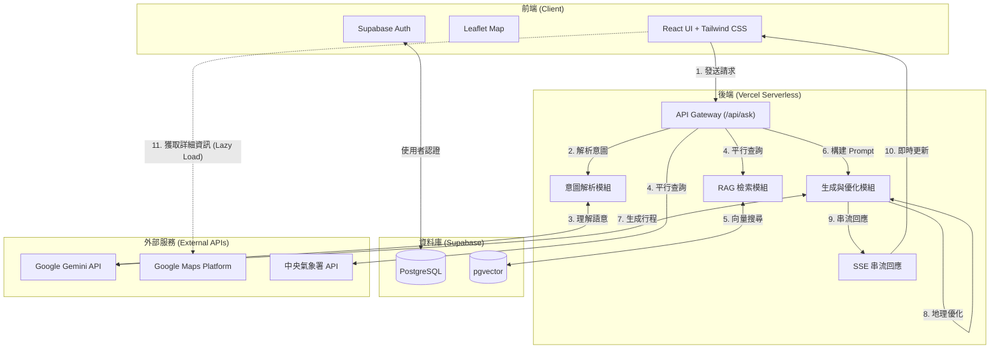

# 導入 RAG 技術之高信賴度台灣旅遊規劃助理：解決生成式 AI 幻覺問題
[.docx](https://1drv.ms/w/c/591788f7986f5135/IQBQmPnXhaSiRZsGPm29N7cbAfmC_sSCfT3yc1S5P1eqxsM?e=MVk9b5)
## 摘要
隨著旅遊需求的個人化與多樣化，傳統的旅遊行程規劃方式（如搜尋引擎、旅遊書籍）已難以滿足現代使用者的需求。資訊過載、景點資訊分散以及路線規劃的複雜性，使得規劃一趟完美的旅程往往需要耗費數小時甚至數天的時間。

本專題旨在開發一套「基於 RAG (Retrieval-Augmented Generation) 技術與生成式 AI 的台灣智慧旅遊行程規劃系統」。系統整合了 Google Gemini 大型語言模型、Supabase 向量資料庫、Google Maps API 以及中央氣象署 (CWA) 開放資料。透過 RAG 技術，我們解決了大型語言模型常見的「幻覺」問題，確保推薦景點的真實性；透過自行研發的地理空間演算法 (Geo-Optimizer)，解決了行程路線順暢度的問題；並採用 Server-Sent Events (SSE) 串流技術，提供使用者即時且流暢的互動體驗。

本報告將詳細闡述系統的架構設計、核心演算法實作、遇到的技術瓶頸及其解決方案，並展示系統的實際應用成果。

## 第一章：緒論
### 1.1 研究背景與動機
在後疫情時代，國內旅遊需求大增，自由行成為主流。然而，規劃自由行行程是一個複雜的決策過程，涉及多個變數：

1.  **地點選擇**：需要從成千上萬個景點中篩選出感興趣的地點。
2.  **時間安排**：需要考慮景點的營業時間、建議停留時間。
3.  **交通路線**：需要規劃最順暢的路線，避免來回奔波。
4.  **外部因素**：天氣狀況直接影響戶外活動的可行性。

現有的 AI 聊天機器人（如 ChatGPT、Gemini）雖然能生成行程，但常面臨以下問題：
*   **資料過時**：無法獲取最新的景點狀態（如已歇業）。
*   **地理概念薄弱**：常安排出不合理路線。
*   **缺乏細節**：無法提供具體的營業時間、評分或照片。
*   
因此，開發一個能夠結合「AI 創意生成」與「真實數據驗證」的智慧旅遊規劃系統，具有極高的實用價值。

### 1.2 研究目的
本專題的主要目的如下：
1.  **自動化行程規劃**：使用者僅需輸入自然語言（如「明天要去台北玩，想吃美食」），系統即可自動生成完整行程。
2.  **確保資料真實性**：利用 RAG 技術，將 AI 的生成限制在真實存在的景點資料庫範圍內。
3.  **優化路線安排**：透過演算法計算景點間的距離與群聚關係，自動排序出最短路徑。
4.  **整合即時資訊**：將天氣預報與 Google Maps 的即時資訊（評分、照片）整合至行程中。

### 1.3 系統範圍與限制
*   **地理範圍**：目前專注於台灣本島及離島的旅遊行程。
*   **資料來源**：景點資料來自政府開放資料平台及 Google Maps API；天氣資料來自中央氣象署。
*   **平台**：Web 網頁應用程式，支援響應式設計 (RWD)，可於手機與電腦瀏覽。

---

## 第二章：文獻探討與技術背景
### 2.1 生成式 AI 與大型語言模型 (LLM)
本系統採用 Google 的 **Gemini 2.5 Flash** 模型。相較於其他模型，Gemini 2.5 Flash 具有以下優勢：
*   **長上下文窗口 (Long Context Window)**：能夠處理大量的 RAG 檢索資料（數十個景點的詳細描述）。
*   **回應速度快**：生成行程不會讓使用者等待過久。
*   **JSON 輸出能力強**：能穩定輸出結構化的 JSON 資料，便於程式解析。
### 2.2 檢索增強生成 (RAG) 技術原理
RAG (Retrieval-Augmented Generation) 是目前解決 LLM 幻覺問題最有效的方法之一。其運作流程為：
1.  **檢索 (Retrieve)**：根據使用者的查詢，從向量資料庫中檢索出最相關的知識（景點資料）。
2.  **增強 (Augment)**：將檢索到的知識作為「上下文 (Context)」放入 Prompt 中。
3.  **生成 (Generate)**：LLM 根據增強後的 Prompt 生成回答。

本系統利用 RAG 確保 AI 推薦的每一個景點都是資料庫中真實存在的，並且擁有正確的地址與描述。
### 2.3 向量資料庫與語意搜尋
為了實現高效的檢索，我們使用 **Supabase (PostgreSQL)** 搭配 **pgvector** 擴充套件。
*   **Embedding 模型**：使用 Google 的 `gemini-embedding-001` 模型，專門針對中文語意理解進行優化，能夠準確捕捉繁體中文的語意特徵。將景點的描述、標籤、地點轉換為 768 維的向量表示。
*   **相似度計算**：使用餘弦相似度 (Cosine Similarity) 計算使用者查詢向量與景點向量的距離，找出語意最相近的景點。例如，搜尋「適合帶小孩的地方」能自動匹配到「公園」、「觀光工廠」等景點，即使關鍵字不完全匹配。
*   **動態閾值策略**：主要檢索閾值設定為 0.35，確保推薦景點的相關性；對於餐廳類別採用較低的閾值（0.28），以提供更多樣化的美食選擇；當檢索結果不足時，系統會自動降低閾值進行多層級回退檢索（0.14 → 0.035），保證即使在語意匹配較弱的情況下也能提供基本推薦。
### 2.4 地理資訊系統與路徑規劃演算法
為了將 AI 推薦的景點串聯成合理的旅遊路線，本系統使用貪婪最近鄰演算法找到下一個距離最近的景點。

#### 2.4.1 Google Maps Platform
本系統利用 Google Maps Platform 提供的 API 服務來處理地理空間數據：
*   **Places API**：提供豐富的景點資訊（如評分、評論數、照片、營業時間），增強使用者對景點的了解。
*   **Find Place API**：用於將文字地址轉換為精確的經緯度座標 (Geocoding)，這是後續路徑計算的基礎。
*   **Directions API**：用於計算景點之間的實際交通時間與距離，提供更精確的行程評估。
#### 2.4.2 路徑規劃演算法
1.  **K-Means 分群演算法 (K-Means Clustering)**：
    *   **應用**：將多日行程的景點依據經緯度分為 $K$ 個群集（$K$ 為天數），確保每天的行程集中在同一區域。

2.  **貪婪最近鄰演算法 (Greedy Nearest Neighbor Algorithm)**：
    *   **應用**：用於單日行程內的景點排序。從起點出發，每次選擇距離最近的下一個點，以最小化移動距離。

3.  **Haversine 公式**：
    *   **應用**：用於計算地球表面兩點之間的大圓距離，作為上述演算法的距離計算基礎。
    *   **選擇原因**：雖然 Google Maps Directions API 能提供精確的行車距離，但在演算法排序階段需要進行大量的距離比較（複雜度為 $O(N^2)$）。若全數使用 API，將導致高昂的成本與嚴重的網路延遲。因此，我們採用 Haversine 公式進行快速的直線距離估算，僅在最終行程確定後，才使用 API 計算實際交通時間（詳見 4.5 節）。
    $$
    d = 2R \cdot \arcsin\left(\sqrt{\sin^2\left(\frac{\Delta\phi}{2}\right) + \cos \phi_1 \cdot \cos \phi_2 \cdot \sin^2\left(\frac{\Delta\lambda}{2}\right)}\right)
    $$
    
### 2.5 威爾遜分數
為了凸顯出景點的真實分數，我們使用評分與評論數進行威爾遜分數的運算。
相同是4.5顆星，1000則評論與100則評論的4.5顆星在分數上明顯代表不同含意。
    $$
    S = \frac{\hat{p} + \frac{z^2}{2n} - z\sqrt{\frac{\hat{p}(1-\hat{p})}{n} + \frac{z^2}{4n^2}}}{1 + \frac{z^2}{n}}
    $$
其中 $\hat{p}$ 為正面評價比例（將 1-5 星正規化為 0-1），$n$ 為總評論數，$z$ 為常態分佈的信心水準參數（本系統取 1.96，即 95% 信心水準）。

---

## 第三章：系統架構與設計
### 3.1 系統總體架構圖

### 3.2 前端設計 (React + Vite)
*   **框架**：React 18。
*   **建置工具**：Vite，提供極快的熱更新與打包速度。
*   **UI 庫**：Tailwind CSS，實現高度客製化且響應式的介面。
*   **狀態管理**：使用 React Hooks (`useState`, `useEffect`, `useRef`) 管理複雜的串流資料狀態。
*   **地圖整合**：使用 `react-leaflet` 搭配 OpenStreetMap 實作互動式地圖，並整合 Google Maps API 獲取地點詳細資訊。
*   **使用者認證**：整合 Supabase Auth，實作使用者註冊、登入與行程管理功能。
### 3.3 後端設計 (Vercel Serverless Functions)

後端核心邏輯位於 `api/ask.js`，採用 **Event-Driven** 架構設計，以應對複雜的 AI 生成流程與 Vercel Serverless 的執行限制。

#### 3.3.1 執行流程管線 (Execution Pipeline)
系統採用「分階段平行處理」策略，將單次請求拆解為多個非同步任務：
1.  **意圖解析**：首先呼叫輕量級模型 (`gemini-2.5-flash-lite`) 解析自然語言，提取 `city` (縣市)、`days` (天數)。
2.  **平行資料獲取**：利用 `Promise.all` 同時啟動兩大任務：
    *   **天氣查詢**：向中央氣象署獲取目標縣市未來一週預報。
    *   **RAG 檢索**：向 Supabase 向量資料庫檢索相關景點與餐廳。
3.  **上下文構建**：將天氣資訊與 RAG 檢索到的真實景點資料（包含名稱、描述、評分）組合成結構化的 Prompt。
4.  **生成與優化**：
    *   呼叫 `gemini-2.5-flash` 生成初步行程 JSON。
    *   **座標回填**：優先使用 RAG 資料庫中的座標，缺失部分才呼叫 Google Maps API，大幅降低延遲。
    *   **路徑演算法**：執行 `optimizeDayWithLunch` 演算法，對生成的景點進行地理排序與午餐時段最佳化。

#### 3.3.2 Server-Sent Events (SSE) 串流機制
為了解決長達 30-60 秒的生成等待，後端不使用傳統的 Request-Response，而是建立長連線 (Keep-Alive)，透過 SSE 協議即時推播處理狀態：
*   `event: parsing`：通知前端正在解析使用者意圖。
*   `event: weather` / `event: rag`：回報外部資料獲取進度。
*   `event: generation`：通知開始進行 LLM 生成。
*   `event: result`：傳送最終包含地理資訊的完整行程 JSON。

#### 3.3.3 混合式資料策略 (Hybrid Data Strategy)
為了規避 Vercel Serverless Function 的 **60秒執行時間限制 (Timeout)**，我們將資料獲取分為兩階段：
*   **後端 (Backend)**：僅獲取「路徑規劃」必要的**經緯度座標**。
*   **前端 (Frontend)**：在渲染行程卡片時，才非同步獲取**照片、詳細評論、營業時間**等非核心資料。此舉成功將後端處理時間控制在 20-40 秒的安全範圍內。
### 3.4 資料庫設計 (Supabase)
主要資料表 `attractions` 結構如下：
*   `id`: UUID
*   `name`: 景點名稱
*   `city`: 縣市
*   `district`: 行政區
*   `description`: 詳細描述
*   `category`: 類別（自然、文化、美食等）
*   `features`: 特點
*   `embedding`: vector(768) - 儲存語意向量

### 3.5 外部 API 整合策略

1.  **Google Gemini API**：核心大腦，負責理解語意與生成行程。
2.  **Google Maps API**：
    *   `Places API (New)`：獲取景點評分、評論數、照片、營業時間。
    *   `Find Place API`：用於地址校正與座標查詢。
3.  **中央氣象署 API**：獲取全台各縣市未來一週的天氣預報。

---

## 第四章：核心功能實作細節
### 4.1 自然語言意圖解析模組 (parseQueryWithGemini)
這是系統的第一道關卡。我們不使用傳統的關鍵字匹配，而是讓 AI 理解使用者的自然語言。
*   **Prompt 設計**：要求 AI 提取 `city` (縣市), `days` (天數)。
### 4.2 RAG 檢索系統實作 (ragRetriever.js)
1.  **平行查詢**：同時發起兩個向量搜尋請求，一個專門搜尋「景點」，另一個專門搜尋「餐廳」。
2.  **動態閾值**：
    *   對於一般景點，設定相似度閾值為 0.35，在精確度與召回率之間取得平衡。
    *   對於餐廳，採用較低的閾值 0.28 (0.35 × 0.8) 並增加檢索數量，因為美食的定義較為主觀且多樣，需要提供更多選擇。
    *   當檢索結果不足時，啟動多層級回退機制：第一層降至 0.14 (0.35 × 0.4)，第二層降至 0.035 (0.35 × 0.1)，並逐步放寬檢索數量限制，確保即使在冷門查詢或小眾偏好下也能提供基本推薦。
### 4.3 地理空間優化演算法 (Geo-Optimizer)
這是本系統與一般 AI 聊天機器人最大的區別。AI 生成的行程往往缺乏地理順序概念，我們透過演算法進行後處理：

1.  **K-Means 分群 (Clustering)**：
    *   如果行程是多天（例如 3 天），我們將所有選定的景點座標放入 K-Means 演算法，將其分為 3 個群集 (Cluster)。
    *   這樣可以確保每一天的行程都集中在同一個區域，避免跨縣市來回移動。

2.  **貪婪最近鄰演算法 (Greedy Nearest Neighbor)**：
    *   在每一天的行程內部，我們使用最近鄰演算法進行排序。
    *   從起點（或第一個景點）開始，每次尋找距離當前點最近的下一個未訪問點。
    *   **午餐優化**：特別設計了 `optimizeDayWithLunch` 函數，確保午餐地點被安排在行程的中間時段，而不是一早或晚上。
### 4.4 混合式資料豐富化策略 (Hybrid Data Enrichment)

為了獲取景點的詳細資訊（如照片、評分），需要呼叫 Google Maps API。然而，後端 Serverless Function 有執行時間限制 (60秒)。如果後端依序查詢所有景點的詳細資料，極易超時。

我們採取了創新的**混合式策略**：
1.  **後端輕量查詢**：後端僅負責查詢「座標 (Lat/Lng)」，因為這是路線優化所必須的。我們使用輕量級的 `enrichWithCoordinates` 函數，只請求 Geometry 欄位，速度極快。
2.  **前端深度查詢**：照片、評分、評論等「非必要但提升體驗」的資料，由前端 React 元件在渲染時，透過 `useEffect` 非同步向 Google Maps API 請求。
3.  **優勢**：大幅降低後端負擔，縮短首屏載入時間 (Time to First Byte)，並徹底解決了 Vercel Timeout 問題。

### 4.5 交通時間與路徑計算

為了提供更精確的行程安排，系統不僅依賴直線距離，更整合了 **Google Directions API** 進行實際交通時間的計算：
*   **平行運算**：在行程生成的最後階段，後端會平行發送多個 API 請求，計算相鄰景點間的開車或大眾運輸時間。
*   **資訊整合**：將計算出的「預估交通時間」與「距離」插入行程卡片中，讓使用者能更準確地掌握移動成本。

### 4.6 即時天氣資訊整合

系統會根據使用者輸入的日期，呼叫 CWA API 獲取對應縣市的天氣預報。
*   **資料綁定**：將天氣資訊（溫度、降雨機率、天氣現象）注入到 Prompt 中。
*   **AI 決策**：AI 會根據天氣調整行程。例如，若預報下雨，AI 會傾向安排室內景點（博物館、百貨公司）；若天氣晴朗，則安排戶外活動。

---

## 第五章：系統效能優化與挑戰解決
### 5.1 Vercel Serverless Timeout (60s) 的挑戰與對策

**問題描述**：在開發初期，後端負責所有工作（解析、RAG、生成、Map API 查詢）。當行程天數較多時，Google Maps API 的多次回應時間加上 Gemini 的生成時間，經常超過 60 秒，導致前端收到 504 Gateway Timeout 錯誤。

**解決方案**：
1.  **架構重構**：將「地圖詳細資訊查詢」移至前端（如 4.4 節所述）。
2.  **平行處理**：使用 `Promise.all` 同時執行「天氣查詢」與「RAG 檢索」，將等待時間重疊。
3.  **RAG 資料回填**：利用 RAG 資料庫中已有的座標資訊直接回填，減少對 Google Maps API 的依賴。

### 5.2 解決 AI 幻覺：真實性驗證機制

**問題描述**：測試時發現經常推薦已經歇業的店家。

**解決方案**：
1.  **資料庫白名單**：RAG 檢索出的結果作為「白名單」，AI 僅能從中挑選景點進行排列組合。
2.  **Google Map API 協助校正**：針對每個景點進行搜尋，若是 Places API 發現該景點、餐廳暫停營業或歇業會出現提示在景點卡片提醒使用者。

### 5.3 提升使用者體驗：SSE 串流回應

**問題描述**：生成一個完整的三天行程可能需要一分鐘以上。如果使用傳統的 Request-Response 模式，使用者會面對長達一分鐘的空白畫面，體驗極差。

**解決方案**：
*   採用 **Server-Sent Events (SSE)**。
*   後端在處理的每個階段（解析完成、天氣獲取中、RAG 檢索中、生成中）都會發送一個 Event 到前端。
*   前端即時顯示進度條與狀態文字（例如：「正在搜尋台北的美食...」、「正在查詢天氣...」），讓使用者感知系統正在運作。

---

## 第六章：系統成效評估與比較分析
### 6.1 實驗設計與評估指標
* **測試樣本**：選取 N 組不同難度的旅遊需求（單日/多日、特定主題）。
* **評估指標**：景點真實性、路徑順暢度、資訊時效性。
### 6.2 對照實驗：本系統 vs. 原生 Gemini 2.5 flash
* **6.2.1 案例一：台南三天兩日遊**
輸入prompt：我想要去台南三天兩夜，喜歡古蹟和美食。
    * 原生 Gemini：

欣葉台菜並沒有在台南有分店

紅瓦屋餐廳並不存在

紅毛港海鮮餐廳實際在高雄，但因為「紅毛」的關係AI認為他在台南
    * 本系統：不會發生上述問題，因為都是使用資料庫中真實的資料。

* **6.2.2 案例二：「已歇業」陷阱測試**
輸入prompt：明天我想要去一趟嘉義，我要去「風尚人文咖啡館」。
    * 原生 Gemini：

    * 本系統：

    * 結果分析：
        * 原生Gemini尋找到的答案是【風尚人文咖啡館 (嘉義博愛店)】(Google Map 尋找最佳結果是【風尚人文咖啡館(豐樂店)】，實際上【風尚人文咖啡館 (嘉義博愛店)】是已經歇業的)。
        * 本系統一樣會找到已經歇業的【風尚人文咖啡館 (嘉義博愛店)】，但是可以通過回報機制讓管理人員將已經歇業的地點刪除。

### 6.3 系統介面與操作流程展示
* **6.3.1 使用者介面流程**
    1.  **首頁**：
hackmd說我圖片太大了丟不上來
    2.  **規劃行程**：

    3.  **景點資料庫**：

    4.  **載入中**：顯示即時進度。
    
    
    5.  **結果頁**：
        *   **行程選擇**：原生 AI 生成的行程與使用 RAG 資料庫的行程可以快速比較

        *   **AI 參考資料來源 (RAG)**：列出資料庫搜索到的真實地點資料。

        *   **天氣卡片**：顯示台南週末兩天的天氣概況。

        *   **地圖視圖**：標記出所有景點與路線。

        *   **行程列表**：右側為時間軸式的行程，包含景點照片、評分、建議停留時間。

        *   **景點卡片**：通過Google Map API 抓取該景點詳細資料

### 6.4 綜合分析討論

## 第七章：結論與未來展望
### 7.1 結論
本專題開發了一套整合 RAG 技術與生成式 AI 的智慧旅遊行程規劃系統。透過混合式的資料處理架構與地理空間演算法，我們克服了傳統 AI 行程規劃中「幻覺」、「路線不順」與「資料過時」的三大痛點。系統不僅能生成合理的行程，更能提供豐富的視覺資訊與即時天氣預報，極大化了使用者的規劃效率。

技術上，我們證明了在 Serverless 架構下，透過合理的任務分配（前後端分工）與演算法優化，能夠運行複雜的 AI 應用，並保持良好的效能與成本效益。
### 7.2 未來工作
1.  **住宿推薦整合**：與訂房網 API (如 Booking.com, Agoda) 串接，根據行程落腳點自動推薦附近飯店。
2.  **社群功能**：允許使用者對 AI 生成的行程進行評分與回饋，利用 RLHF (Reinforcement Learning from Human Feedback) 進一步優化模型。

## 參考文獻

[1] Lewis, P., Perez, E., Piktus, A., Petroni, F., Karpukhin, V., Goyal, N., ... & Kiela, D. (2020). Retrieval-augmented generation for knowledge-intensive NLP tasks. *Advances in Neural Information Processing Systems*, 33, 9459-9474.

[2] Google AI. (2024). Gemini API Documentation. Retrieved from https://ai.google.dev/docs

[3] Mikolov, T., Chen, K., Corrado, G., & Dean, J. (2013). Efficient estimation of word representations in vector space. *arXiv preprint arXiv:1301.3781*.

[4] Johnson, J., Douze, M., & Jégou, H. (2019). Billion-scale similarity search with GPUs. *IEEE Transactions on Big Data*, 7(3), 535-547.

[5] PostgreSQL Global Development Group. (2023). pgvector: Open-source vector similarity search for Postgres. Retrieved from https://github.com/pgvector/pgvector

[6] MacQueen, J. (1967). Some methods for classification and analysis of multivariate observations. *Proceedings of the Fifth Berkeley Symposium on Mathematical Statistics and Probability*, 1(14), 281-297.

[7] Wilson, E. B. (1927). Probable inference, the law of succession, and statistical inference. *Journal of the American Statistical Association*, 22(158), 209-212.

[8] Vercel Inc. (2024). Vercel Serverless Functions Documentation. Retrieved from https://vercel.com/docs/functions

[9] Meta Platforms. (2024). React: A JavaScript library for building user interfaces. Retrieved from https://react.dev/

[10] 中央氣象署. (2024). 開放資料平台 API 文件. Retrieved from https://opendata.cwa.gov.tw/

[11] Google Maps Platform. (2024). Places API (New) Documentation. Retrieved from https://developers.google.com/maps/documentation/places/web-service/overview

[12] Supabase Inc. (2024). Supabase: The Open Source Firebase Alternative. Retrieved from https://supabase.com/docs

[13] Vaswani, A., Shazeer, N., Parmar, N., Uszkoreit, J., Jones, L., Gomez, A. N., ... & Polosukhin, I. (2017). Attention is all you need. *Advances in Neural Information Processing Systems*, 30.

[14] Devlin, J., Chang, M. W., Lee, K., & Toutanova, K. (2018). BERT: Pre-training of deep bidirectional transformers for language understanding. *arXiv preprint arXiv:1810.04805*.

[15] 交通部觀光署. (2024). 觀光統計資料庫. Retrieved from https://stat.taiwan.net.tw/

## 進度
- [ ] 目錄
- [x] 摘要
- [x] 第一章
- [x] 第二章
- [ ] 第三章 / 3.1系統總體架構圖未放圖
- [ ] 第四章
- [ ] 第五章
- [ ] 第六章
- [ ] 第七章
- [ ] 參考文獻
#### 檢查
- [ ] 每頁頁數是否正確(參考文獻目前錯誤)
- [ ] 目錄頁數是否正確